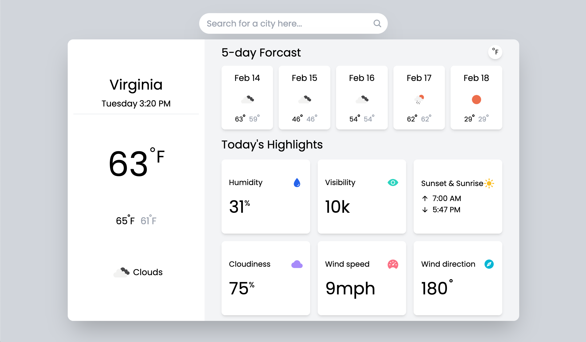

# WeatherApp

A simple weather application built with vanilla JavaScript, HTML, and Tailwind CSS
Live: https://supersakana.github.io/weather_app/

## About

This project was an oppertunity for me to practice aysnc/await functions to handle third-party APIs. All the data being fetched is from [OpenWeather](https://openweathermap.org/). Not only did I get to practice my JavaScript skills on this, but I also became more familiar working with Webpack and NPM. Going through OpenWeather's documentation and uncovering all the API's services was another cool learning experience. Still have a lot to learn with Webpack so if you see areas I can improve on, feel free to reach out to me.

Full Project Description
https://www.theodinproject.com/lessons/javascript-weather-app
